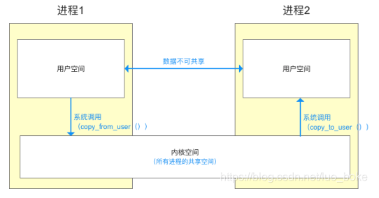

git地址: https://github.com/tencent/mmkv

# 一、 几个概念

- 1 物理内存/内存(RAM)
    - 存储正在运行的程序和数据的临时存储器,电源关闭数据就会丢失,大小有限
    - 读写速度快

- 2 磁盘上的存储空间
    - 长期存储介质,包括硬盘(HDD)、固态硬盘(SSD)
    - 读写速度相对慢

通过虚拟内存管理在计算机系统中进行交互.   
虚拟内存管理系统允许进程在虚拟地址空间中访问数据，而这些数据可能存在于物理内存中，也可能存在于磁盘上。如果数据在物理内存中，则可以直接访问。如果数据在磁盘上，则虚拟内存管理系统会负责将数据从磁盘加载到物理内存中，以便进程可以访问它。这个过程是透明的，进程不需要知道数据的物理位置。    

# MMKV的原理
https://blog.csdn.net/luo_boke/article/details/126810751

mmap（内存映射）是一种在计算机中将文件或其他对象映射到内存的机制。通过 mmap，你可以将文件的内容直接映射到进程的地址空间，这意味着你可以像访问内存一样访问文件的内容，而不必通过常规的读写文件 I/O 操作。mmap 通常用于以下几个方面：
